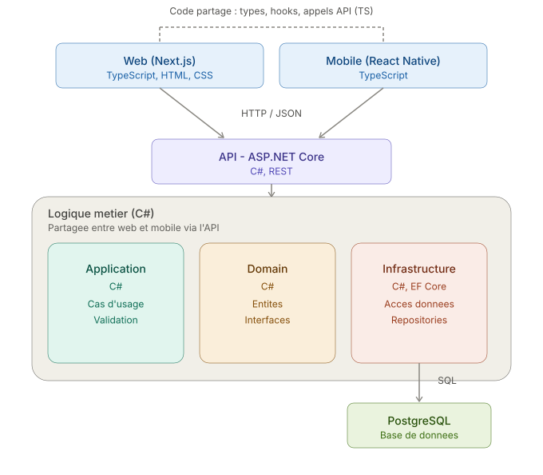

# AlgoProd
Explorer et Comprendre Algortihmes et Concepts 

## Context 
L'algorithmique est une partie de l'informatique que j'aime particulièrement, c'est le parfait compromis entre mathématique et informatique.
  Mais cette partie est aussi pationante que difficile à comprendre.
  C'est pour cela que j'ai décidé de regrouper le plus d'algorithmes intéréssants à étudier ainsi que de les classés par méthodes de programtion (ex: programation dynamique, programation parallèle, programation séquentiel, etc..)
  Le but est de permettre a n'importe quel étudiant de comprendre un concept de l'algorithmique ainsi que ces différents algorithmes utilisant ce même concept.   

## Comment
#### Pas forcément joli mais avec un bon UX pour permettre compréhensiion et rapidité !

- L'interface web en Next.js ou Vue.js; Incluant TypeScript, HTML, CSS.
- Appli Mobile en React Native pour du TypeScript.
- API - ASP.NET Core; Incluant C#, REST
- BDD en PostgreSQL

- Plus ordonnancé que possible avec des repertoires et des types d'algos
- Faire authentification pour ajouter des algos et avoir un/plusieurs cpt admin 
- base de donnée api externe pour permettre utilisation par tous. 

## Idées

- Tous le temps utiliser des verbes pour décrire rapidement, ex: algos Dynamique: Calculer-Retenir-Utiliser/Calculer
- rendre les algos clicables pour permettre description plus précise.
- catégories populaires dans page acceuil ainsis qu'algorithmes populaire, pour ce faire voir comment collecter les données de navigations avec des cookies. 
